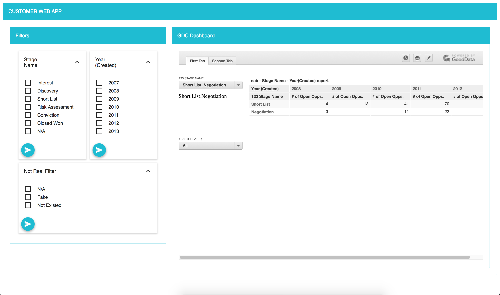

How to use:
1. Install Git, NodeJs, NMP
2. Clone the project
3. Open 'data\dataset01.js' or 'data\dataset02.js' for editing filter data and input embedded url
    - And can add more datasetXX.js for testing multiple case
4. Open 'components\App.js' for importing and applying datasetXX.js
5. Open Terminal, run 'npm install' and 'npm start'
6. Open browser to test at http://localhost:3000, should temporarily disable web security to avoid CORS issue

Note:
1. Enable feature flag "controlExecutionContextEnabled"
2. On Mac, close all Chrome and use this command to re-open Chrome without security setting
    - open -a Google\ Chrome --args --disable-web-security --user-data-dir

Demo:

