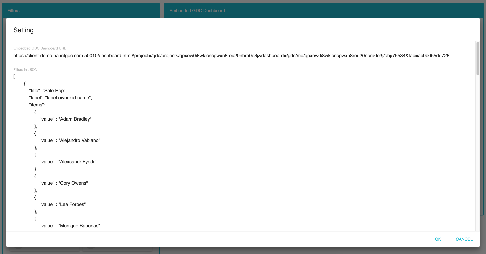
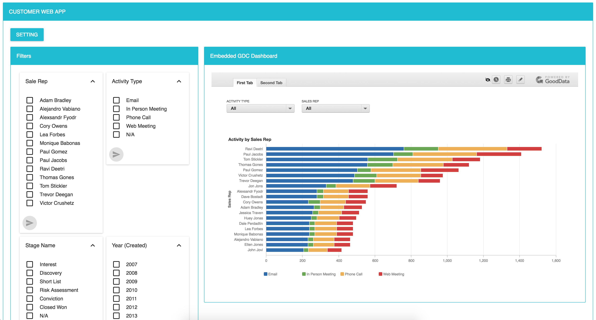

How to use:
1. Install Git, NodeJs, NMP
2. Clone the project
3. Open Terminal, run 'npm install' and 'npm start'
4. Open browser to test at http://localhost:3000
5. Input embedded url and string as json format to render filters

Note:
- Enable feature flag "controlExecutionContextEnabled"

Demo:

